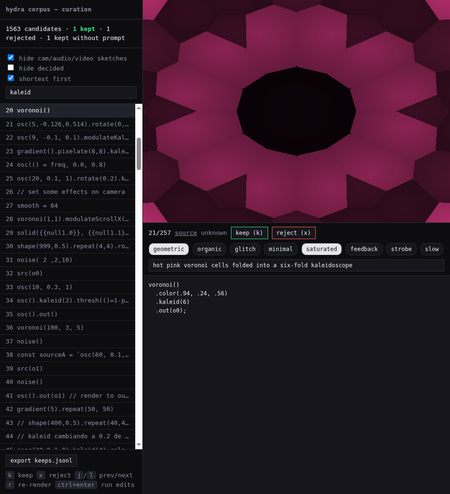
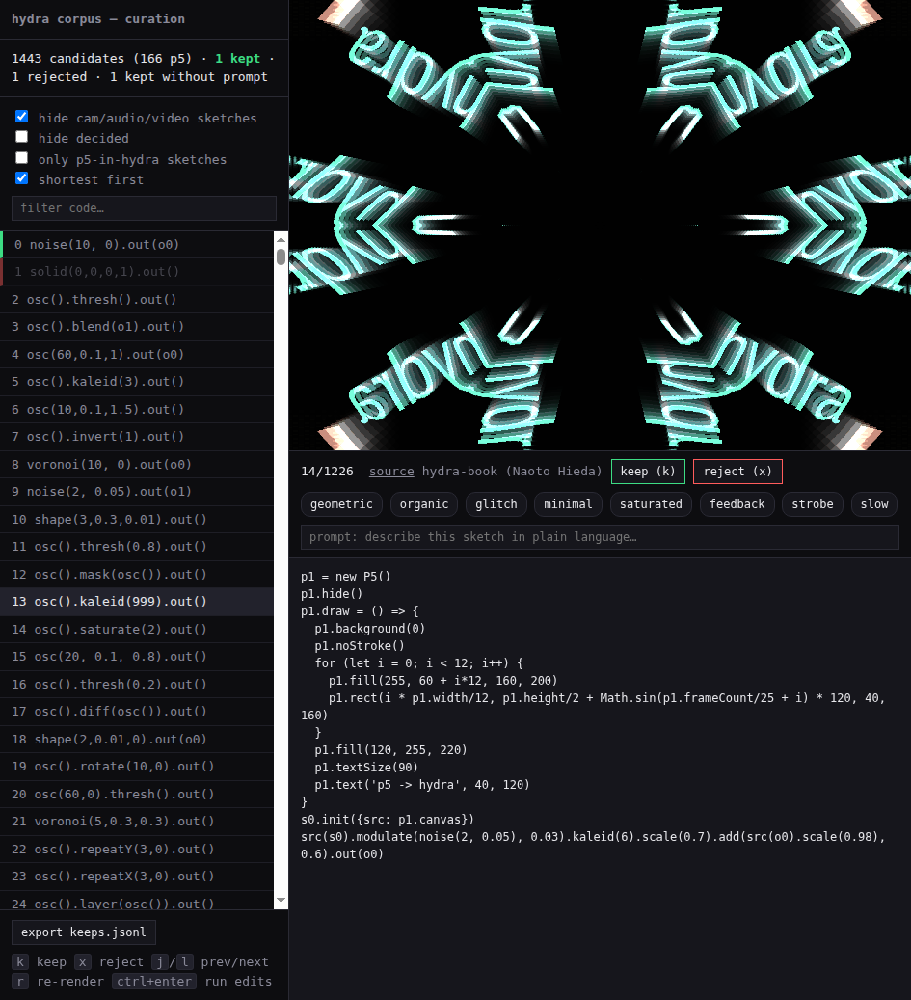
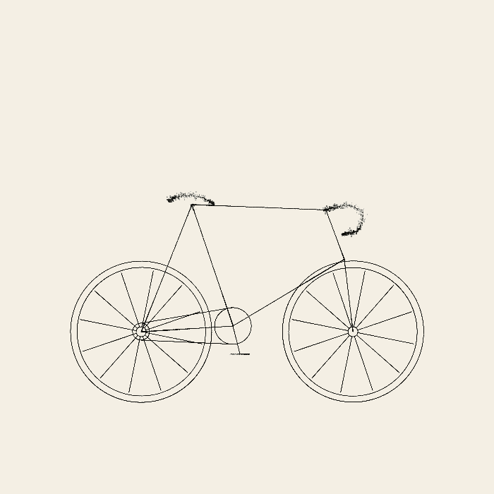
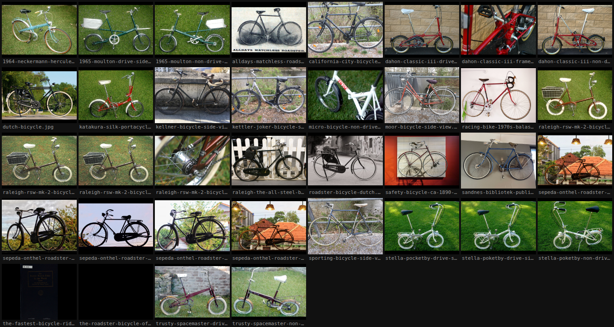
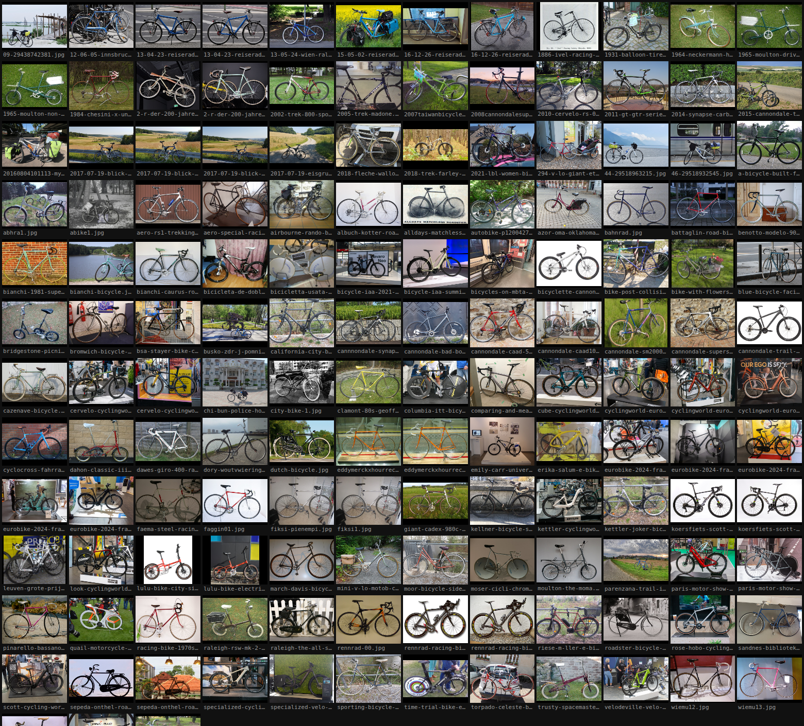
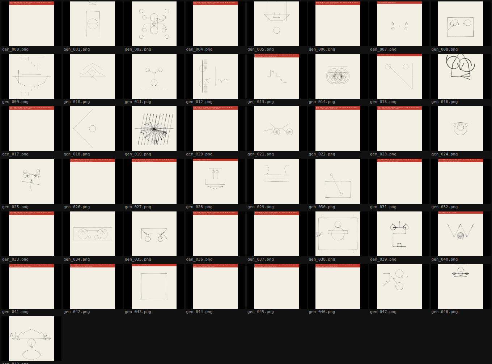
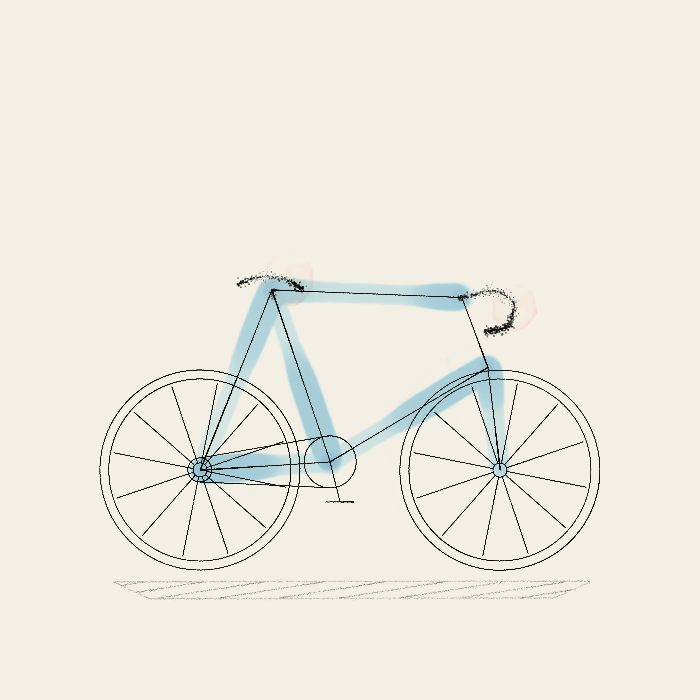
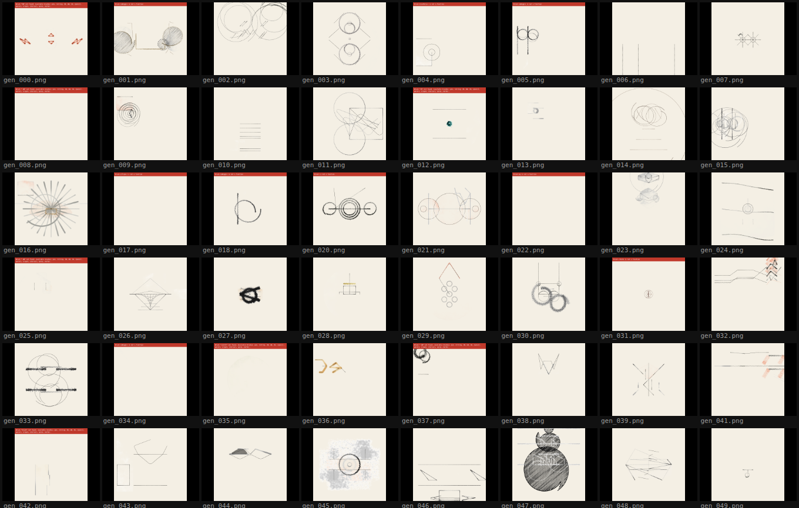
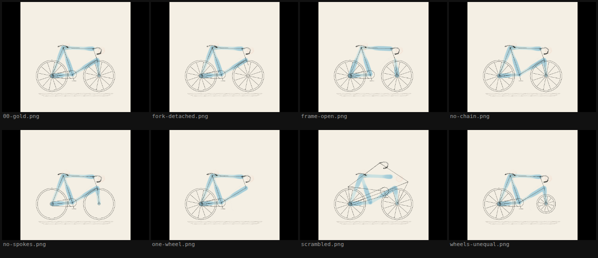
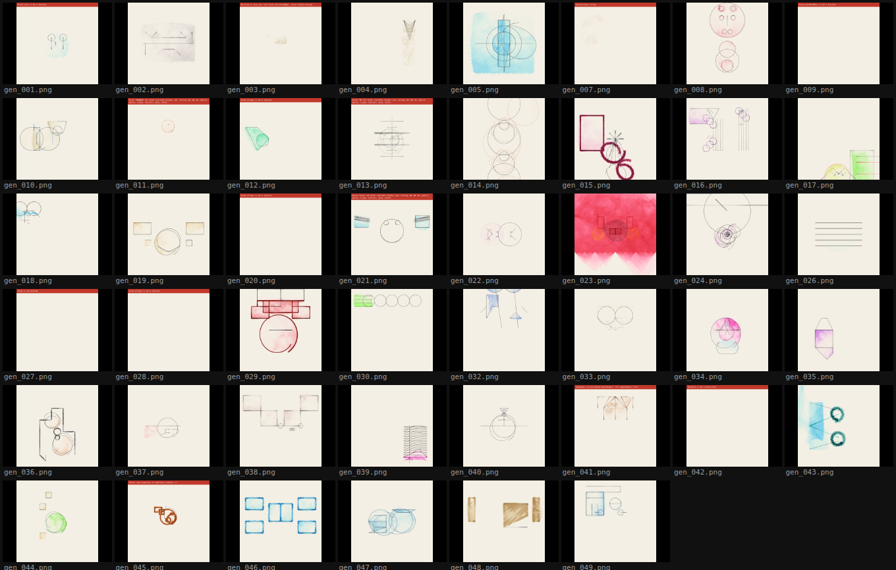

# Bitácora — bicycle-rl

Lab notebook for teaching a model to write [hydra](https://hydra.ojack.xyz/) sketches.
**This file becomes the blog post.** Read `AGENTS.md` → Rule 1 before adding to it.

Append-only. Newest entry at the bottom. Never delete a dead end.

<details>
<summary>Entry template (copy this)</summary>

```markdown
## NNN — YYYY-MM-DD — <title>

**Goal.** One line: what we were trying to get.

**Did.** What actually happened, with commands and paths.

**Why.** The decision, and the alternative we rejected.

**Numbers.** Counts, rates, timings, costs. Anything measurable.

**Dead ends.** What failed and the reason. Keep forever.

**Next.** The one thing that unblocks the next session.
```
</details>

### Blog threads
Narrative arcs to keep an eye on; tick them off as they resolve.

- [ ] *Why hydra and not p5.brush* — the reward signal is a moving image, not a still.
- [ ] *Where do you even get hydra code?* — the corpus problem (entry 002).
- [ ] *What does "good" mean for a video synth sketch?* — reward design.
- [ ] *The judge is the whole game* — pairwise-vs-absolute, borrowed from the surya post.

---

## 001 — 2026-08-26 — Project starts: hydra instead of watercolour

**Goal.** Pick the shape of the project and set up the notebook before writing any code.

**Did.** Read Surya's post, *RL'ing Qwen to paint with code*
(<https://surya.website/rling-qwen-to-paint-with-code>). Its loop: model writes a p5.brush
sketch → Puppeteer renders it to a PNG in a sandbox → reward → GRPO. The parts we are
stealing outright:

- a **binary compile gate** (cheap, catches the 80% failure mode: hallucinated API),
- **pairwise judging against a curated reference pool** rather than absolute 0–10 scoring —
  his numbers say it beat the plateau 3× faster,
- a **short allowlist of functions in the system prompt**; his long API docs made models
  hallucinate *more*, not less.

Our twist: hydra, a live-coding **video** synth. Every sketch is a running feedback loop,
not a still.

**Why.** Hydra is a small, weird, chainable DSL (`osc().kaleid().modulate(noise()).out(o0)`)
that base models half-know: they get the syntax shape right and the operator semantics
wrong — `modulateScrollY` args backwards, `kaleid` misused, feedback via `src(o0)` reached
for at random. That gap is exactly what a LoRA is for. Rejected: doing p5.brush again with a
different prompt — no new information, and his post already answers it.

**Numbers.** None yet. Reference pool in the post: 581 rated images (117 love-tier).
That is the bar for our own reference set; we are starting at 200–300 curated sketches.

**Dead ends.** None yet.

**Next.** We cannot judge, prompt, or fine-tune without a reference set. Build the corpus:
harvest a few hundred real hydra sketches, then hand-curate them.

---

## 002 — 2026-08-26 — The corpus: 1563 candidates, and a wireframe to throw most of them away

**Goal.** 200–300 hand-picked hydra sketches to serve as reference pool + prompt examples.
Nothing like it exists as a dataset — hydra code lives in gists, README files and other
people's livecoding repos.

**Did.** Built `corpus/`, self-contained, two moving parts.

`corpus/harvest.py` (stdlib + the `gh` CLI, no pip install) pulls from three shapes of source:

1. the hydra editor's own examples — `src/stores/examples.json` in `hydra-synth/hydra`,
   where each sketch is base64 of a percent-encoded string (the format the editor uses to
   put a sketch in the URL bar),
2. whole repos via the GitHub trees API + a path regex: `hydra-synth/hydra-examples` (js),
   `micuat/hydra-book` (md, ```hydra fences),
3. **GitHub code search**, 10 queries for hydra idioms (`"out(o0)" "modulate("`,
   `"kaleid(" "osc("`, `"modulatePixelate"`, …) — this is where the volume is.

Extraction is per-format: fenced blocks from markdown, blank-line-separated chunks from js,
base64 from the editor json. A chunk counts as a sketch if it calls a source function and
ends up in a hydra buffer. Deduped by whitespace-stripped content hash, which is also the
`id`, so re-running merges instead of duplicating and curation decisions survive.

`corpus/curate.html` is the wireframe — one file, no build step, hydra-synth from unpkg.
It renders each candidate **live** (this is the point: you cannot judge a video synth
sketch by reading it), `k` keeps, `x` rejects, the code box is editable so a nearly-good
sketch can be trimmed instead of discarded, and every keep gets a plain-language prompt
typed by hand. Decisions in localStorage, export to jsonl.



**Why.**

- *Live render over reading code.* Sketch quality is motion. A still frame or a listing
  cannot tell you that something strobes horribly or sits still for 20 seconds.
- *Prompts typed by a human, not generated.* The prompt side of the pair is the part we
  can't automate honestly — a captioning model would describe the code, not the image.
- *Excluded the extension libraries* (hyper-hydra, hydra-antlia, HY5) even though they are
  well-documented and full of examples. Their functions do not exist in vanilla
  hydra-synth, so training on them would teach the model to hallucinate API — the exact
  failure we are trying to fix. Rejected alternative: include them and add the libs at eval
  time. Not worth the extra dependency in the sandbox.
- *No pip install.* `urllib` + `re` + `http.server` cover all of it.

**Numbers.**

| | |
|---|---|
| files fetched | 386 (13 hydra-examples, 15 hydra-book, 10 searches × 40–60 hits) |
| wall clock | ~2 min, 8 threads |
| **candidates** | **1563** |
| — github-search | 1288 |
| — hydra-book | 174 |
| — hydra editor examples | 57 |
| — hydra-examples repo | 44 |
| need cam/audio/video (hidden by default) | 237 |
| visible in the default curation queue | 1326 |
| median sketch length | ~160 chars |
| target keeps | 200–300, i.e. we throw away ~85% |

**Dead ends.**

- *First filter was too loose:* 1644 candidates, and a good slice of them were fragments of
  other people's frameworks — `function invertExp(sourceOut, out) { src(sourceOut)…out(out) }`.
  Fixed by requiring the sketch to render to a real buffer (`.out()` or `.out(o0..o3)`, not
  `.out(someVariable)`) and dropping chunks with `import`/`export`/`require`/`await`/a
  function declaration. 1644 → 1563, and the junk that remains is junk a human can see.
- *Canvas rendered black for half an hour of debugging.* Chased WebGL context loss,
  `preserveDrawingBuffer`, headless swiftshader — a bare probe page proved hydra rendered
  fine in the same browser, so it was our page. It was **nothing**: the first screenshot
  landed before the first frame. The real bug the detour surfaced: the canvas had no
  `width`/`height` attributes, so hydra was rendering 300×150 and CSS was upscaling it to
  645×467. Curating blurry sketches would have been quietly bad. Two lines: set the backing
  store to the client size at init, `setResolution` on resize.
- *Repos have spaces and non-ASCII in filenames* (`10.02.22@düker.js`). urllib throws
  `InvalidURL`/`UnicodeEncodeError` rather than quoting for you; ~9 files lost before
  wrapping paths in `urllib.parse.quote`.

**Next.** Sit down and curate. 1326 in the queue, keep the first ~250 that render, are
self-contained, and are not the fifth `osc().kaleid()` in a row. Then `data/reference.jsonl`
exists and we can start thinking about the reward.

## 003 — 2026-08-26 — p5 inside hydra, and the extraction bug it exposed

**Goal.** Make sure the corpus contains **p5 running inside hydra**, not just pure GLSL
chains. Asked for explicitly: p5 is where the richer visuals come from.

**Did.** The idiom is:

```js
p1 = new P5()
p1.hide()
p1.draw = () => { p1.background(0); p1.text('hydra', 60, 200) }
s0.init({ src: p1.canvas })
src(s0).modulate(noise(2), 0.03).kaleid(6).out(o0)
```

Three things had to change.

1. **The harvester was decapitating every p5 sketch.** We split js files on blank lines, and
   in a p5 sketch `p1 = new P5()` and `s0.init({src: p1.canvas})` sit paragraphs above the
   `src(s0)…out()` that needs them — we were storing the last paragraph only, which is not a
   runnable sketch. `from_js` now accumulates chunks, emits on a render call, and carries
   *setup* lines (`new P5(`, `.init(`, `await loadScript`) forward past prose blocks and past
   the emit, since one file's p5 canvas is usually shared by several sketches below it.
2. **The filters were rejecting p5 sketches on sight.** `await` was in the junk regex (it
   catches strudel/csound framework code) but `await loadScript(...)` is the hydra editor's
   own idiom — now `await (?!loadScript)`. And `loadScript` was in `NEEDS_INPUT`, which hid
   the sketches behind the "needs camera" filter. Loading a script is not a device.
3. **The preview had to actually run p5.** `curate.html` now loads p5, inlines the editor's
   `P5` wrapper class (12 lines: instance mode, canvas positioned behind the hydra output,
   `show`/`hide`/`clear`), shims `loadScript`, and evaluates each sketch inside an async
   function so top-level `await` works like in the editor. p5 instances are removed between
   sketches — otherwise every sketch inherits the previous one's draw loop. New `uses_p5`
   field, a badge, and an `only p5-in-hydra sketches` filter for a dedicated curation pass.

Also added `hydra-synth/hydra-docs-v2` (the official docs, 117 md files) as a source — found
while searching for p5 examples, and a good one regardless.



**Why.** GLSL chains cannot do text, typography, precise geometry or per-object logic. p5
inside hydra is the escape hatch, and it is *core* hydra — the editor ships the wrapper — so
it is fair game in a way that hyper-hydra and HY5 are not. The consequence to remember:
**every renderer we build from here (eval harness, RL sandbox) must load p5 and define `P5`,
or every p5 sketch fails the compile gate and the model learns to avoid the richest half of
the language.** Written into `AGENTS.md` so it does not get lost.

**Numbers.**

| | before | after |
|---|---|---|
| candidates | 1563 | **1443** |
| — github-search | 1288 | 945 |
| — hydra-docs (new source) | — | 223 |
| — hydra-book | 174 | 174 |
| — hydra editor examples | 57 | 57 |
| — hydra-examples repo | 44 | 44 |
| p5-in-hydra | not tracked | **166** |
| need cam/audio/video | 237 | 217 |

The total went *down* while sources went up: chunk-gluing merges what used to be counted as
several decapitated fragments into one runnable sketch. 81 of the 166 p5 candidates carry
both a `p5.draw` loop and a `src(s0)` chain, i.e. are complete on their own. Curation target
updated: 200–300 keeps, **at least ~40 of them p5**.

**Dead ends.**

- Considered including `ffd8/HY5` and `munshkr/hydra-p5`, both p5-hydra integration libs
  with plenty of examples. Rejected for the same reason as the other extensions: they
  introduce an API (`H.…`) that vanilla hydra-synth does not have. The wrapper the editor
  already ships is enough.
- One search query, `"loadScript" "out(o0)" extension:js`, returned zero files. Deleted it
  rather than leaving dead config behind.
- Chased a browser-crash-looking `about:blank` for a while during testing; it was the
  headless renderer dying from an earlier session, not the p5 code. Reloading fixed it.

**Next.** Unchanged: curate. Do a normal pass, then a p5-only pass with the filter on.

## 004 — 2026-08-26 — Pivot: drop hydra, draw bicycles with p5.brush

**Goal.** Stop building infrastructure for an abstract goal. Get to the loop from the
original post — model writes code → render → judge → reward — on a target we can look at.

**Did.** Changed the subject twice in one session and it improved both times.

First: hydra → **p5.brush**, same as the post. The reason to leave hydra was not that it is
a bad target, it is that judging *motion* needs a video pipeline we have not built, and
every design question was compounding on top of that. p5.brush renders a still PNG; the
post already proved the reward stack works on stills.

Then: subject → **bicycles**, side view, ink line drawing on off-white paper.
[Velocipedia](https://www.gianlucagimini.it/portfolio-item/velocipedia/) is the reason —
Gimini asked 376 people to draw a bike from memory and almost none could produce a frame
that would hold a wheel. "Can a model draw a bicycle from memory?" is a question with a
visible answer.

Built `bike/`:

- `template.html` — the harness owns the canvas (700×700 WEBGL), the paper (`#f4efe4`), and
  the seeds (`randomSeed`, `noiseSeed`, `brush.seed`, all fixed). **The model writes one
  function, `paint()`, and nothing else.** Runtime errors get painted onto the image as a
  red banner, so a broken sketch is obvious in a contact sheet.
- `render.py` — sketches → PNGs via headless chrome. `node --check` first, because catching
  a syntax error costs milliseconds and launching a browser costs a second.
- `lib/` — p5 2.3.2 + p5.brush 2.2.2, vendored. Thousands of RL rollouts should not each
  hit a CDN.
- `gold/bike_01.js` — a hand-written reference bike, which is also the harness smoke test.

Allowlist for the eventual system prompt, eight methods: `set field wiggle line circle
spline hatch fill`. Straight from the post's finding that a short allowlist beats full API
docs — long reference material made models hallucinate *more* API.



**Why bicycles over the other candidates.** A tree or a hibiscus is judged on aesthetics,
which needs an aesthetic scorer to carry the reward. A bicycle is judged on *structure*
first — two equal wheels, a closed frame, a chain that connects two rings — which a judge
can rank fast and reliably. The trade-off, stated plainly: HPSv3-style aesthetic scoring
will be a weaker signal here than it was for watercolour hibiscus, so the pairwise judge
carries more of the reward.

**Numbers.** Zero dependencies added: node and chrome were already on the box. Render is
~1.5 s per sketch cold. Reference bike: 40 lines of `paint()`, 8 brush methods, 3 iterations
to stop looking like a Velocipedia entry.

**Dead ends.**

- **p5.brush 2.2.2 needs p5 2.x.** Vendored p5 1.9.4 first (it is what the hydra work used)
  and got a blank sheet of paper with a correctly-rendered background — the worst kind of
  failure, since it looks like the sketch is wrong. `p5.registerAddon is not a function`,
  visible only in the console. Documented at the top of `bike/README.md`.
- **`brush.field('hand')` drags a circle off its own centre.** First bike had rims orbiting
  their hubs and spokes shooting past the tyre. The vector field displaces every stroke,
  which is charming on a free line and wrong on a wheel. `noField()` for anything that has
  to be concentric; keep `wiggle(0.03)` for the hand-drawn feel.
- The hydra corpus (`corpus/`, 1443 candidates) is **parked, not deleted**. If the bicycle
  loop works, the same machinery points back at hydra. And the wireframe was never the waste
  — rating generated bicycles is the same tool with images instead of code.

**Next.** Sample a base model ~50 times on the fixed prompt, render the batch, and look at
the contact sheet. That is the "from memory" baseline the whole project is measured against,
and it needs an API key rather than more code from me.

## 005 — 2026-08-26 — The judge: real photos ground it, drawings compete with each other

**Goal.** Turn "a judge says whether it looks like a bike" into a reward that can actually
train something.

**Did.** Built the grounding pool: `bike/fetch_photos.py` pulls real bicycle photographs
from Wikimedia Commons (licensed, credited in `photos/credits.json`), and `bike/sheet.py`
tiles any pile of images into one contact sheet PNG so a batch can be judged by eye in one
look. Culled the pool by hand from the sheet, tightened the fetcher's reject rules, refetched.

Then fixed two holes in the reward design before they cost us a training run.

**Why — the two corrections.**

1. **A photo cannot be the pairwise opponent.** The plan was: judge compares the model's
   drawing against the pool of real bicycles. But ask any judge "which is more like a real
   bicycle, this ink drawing or this photograph" and the photograph wins 100% of the time.
   The reward saturates at zero and carries no gradient — worse, it carries no *information*,
   because it says the same thing about a great drawing and a terrible one. The comparison
   has to stay in-domain: **drawing versus drawing, with a real photo in the prompt as the
   reference for what is true.** GRPO makes this nearly free — the group of rollouts is
   already there, so pairwise win-rate inside the group is the reward.
2. **One binary is too sparse.** "Is this a bicycle: yes/no" is 0 for every rollout in the
   early steps, which is a flat landscape with nothing to climb. Same judge call, five
   grounded yes/no items instead — two wheels / equal size / closed frame / bars joined to
   the fork / a chain connecting two rings — summed to a dense 0–5.

Final shape, mapped onto the post's four components:

| weight | signal |
|---|---|
| 0.05 | compiles and draws (`node --check`, then render; blank paper scores 0) |
| 0.05 | code length band |
| 0.30 | structural checklist, 5 grounded binaries |
| 0.60 | pairwise win-rate inside the GRPO group, photo as reference |

The post spent 0.30 on HPSv3, an aesthetic scorer. We spend it on structure instead, because
a bicycle is judged on facts before taste — and because HPSv3 has little to say about a line
drawing of a machine.

**Numbers.** 68 fetched, 36 culled, 32 kept. Second pass with diamond-frame and road-bike
queries: 72 fetched, 39 culled in total, **33 clean side-view bicycles** in the pool. Judge cost, for later: a round
robin over a group of 8 is 28 calls per step; two random opponents per rollout is 8; one
labelled grid ranked in a single call is 1.

**Dead ends.**

- **Wikimedia's robot policy.** Every download came back `429 Your request does not comply
  with our robot policy` until the User-Agent named the project *and* a contact URL. The
  first, friendlier-looking UA string was the problem, not the request rate — though the
  rate limit is real too, and the fetcher now sleeps 1.5 s between images.
- **Commons photographs folding bikes.** The first pool came out dominated by Moultons,
  Dahons, Raleigh RSWs and Dutch roadsters, because those are what people shoot side-on
  against a wall. A grounding pool of small-wheel folders would teach the checklist judge
  the wrong proportions. Added explicit diamond-frame and road-bike queries.
- **The contact sheet collapsed to three columns** whatever `--cols` said: grid items
  default to `min-width:auto`, so long filenames in the captions refused to shrink. One
  line, `figure{min-width:0}`. Noted because we will use that sheet for every batch from
  here.
- Half of Commons' "bicycle" hits are scanned Victorian books — *Wheels: a Bicycle Romance*,
  *Spalding's Official Bicycle Guide* — whose thumbnails are book covers. The filename tag
  `(IA ...)` marks Internet Archive scans and kills most of them.

**Next.** Baseline batch: sample a base model ~50× on the fixed prompt, render, contact
sheet. Blocked on two choices that are yours — which model writes the sketches, and which
vision model judges them.



## 006 — 2026-08-26 — A wireframe for judging photos, and 200 as the number

**Goal.** Build the pool properly: ~200 reference photographs, each one judged by hand, not
by a regex on a filename.

**Did.** `bike/judge_photos.html` — every candidate as a tile, **click to keep**,
double-click to zoom, filter to all / kept / not-kept, and a progress bar that fills toward
200. Decisions live in localStorage so a session survives a reload. *Export rejects.txt*
writes the filenames not kept; `python3 fetch_photos.py --cull rejects.txt` deletes them and
appends them to `photos/culled.json` so the next fetch never offers them again.

Widened the fetcher to reach that volume: Commons **categories** (`Bicycles`,
`Road bicycles`, `Racing bicycles`, `City bicycles`, `Touring bicycles`, `Utility bicycles`,
`Track bicycles`, `Cargo bicycles`, `Single-speed bicycles`, `Bicycles by model`) on top of
the text searches. Categories are where the volume is; searches are for specific angles.

The keep rule, written into `bike/README.md` so it stays consistent across sessions: a whole
bicycle, side on, unobstructed — two wheels visible, frame legible, nothing sitting on it.
Reject riders, close-ups, three-quarter angles, drawings, book covers, and anything where the
frame vanishes into the background.

Also stopped committing the jpgs. `credits.json` pins the exact thumbnail URL for every file,
so `--restore` rebuilds the pool from the json and git stays small.

**Why 200 and why by hand.** The pool is what the checklist judge is grounded on and what
"a bicycle" means for the whole run. A regex that trusts filenames put NATO map symbology and
Victorian book covers in the pool twice — see the dead ends below. Two hundred is the number
because the post's own pool was 581 rated images and it is the one part of the pipeline where
a human hour buys more than a compute hour.

**Numbers.** **600 candidates**, 136 MB, from 16 Commons categories and 9 searches; 39
already culled and remembered from the earlier regex-only passes. Biggest single sources:
`category:Bicycles` and `roadster bicycle` for the old stuff, and for modern road bikes the
brand categories — Bianchi 48, Trek 46, Giant 44, Cannondale 44, Time trial 44, plus 22 from
`carbon road bicycle`. Four searches returned 0 usable because the categories had already
claimed those files. Target: 200 keeps, judged by hand.

Modern road bikes needed one fix to arrive at all: Commons files them under brand names
(*Trek Madone 2019.jpg*), and the title filter demanded the word "bicycle". Category members
now skip that check — the category already guarantees the topic.

**Dead ends.**

- **`"diamond frame bicycle"` returns NATO map symbols.** A dozen red-and-white diamonds
  landed in the pool. Swapped the query, and added `military|symbol|hostile|neutral` to the
  reject list — but the real lesson is that filename filtering has a floor, and the floor is
  why the wireframe exists.
- **A cull did not stick.** Deleting files and refetching handed the same junk straight back,
  because the search returns the same hits and the file was simply missing again. Deletions
  are now recorded in `culled.json` and skipped on every future fetch.
- **Category listings return stubs.** `generator=categorymembers` includes pages with no
  `imageinfo` at all, and SVGs and PDFs that do have a `thumburl` — the crash was a plain
  `KeyError: 'imageinfo'` mid-download. Now guarded, and only `.jpg`/`.png` are accepted.

**Next.** Judge the pool down to 200, then the baseline batch — still waiting on which model
writes the sketches and which vision model judges them.

## 007 — 2026-08-26 — Pool closed: 147 photographs, judged by hand

**Goal.** Decide whether the curated pool is big enough to stop.

**Did.** Judged 601 candidates down to **147** in `judge_photos.html`, exported rejects and
culled them (`fetch_photos.py --cull`). `photos/culled.json` now holds 493 filenames that no
future fetch will offer again. 31 MB on disk, gitignored; `credits.json` pins the exact
thumbnail URL of every survivor, so `--restore` rebuilds the pool from the repo.



**Why 147 is enough — and why the post needed 581.** Different jobs. The post's pool was a
pool of *opponents*: every pairwise comparison consumed a reference artwork, so its size and
diversity set the reward ceiling directly. Ours is *ground truth about an object*. A judge
call shows one photograph beside one drawing and asks five structural questions. Thirty
would function; 147 means references repeat rarely enough that the judge cannot memorise
them. Spread mattered, not count — and the spread is there:

| | |
|---|---|
| modern road / race (carbon, brand-era) | 47 |
| classic steel road | 21 |
| roadster / city / Dutch | 15 |
| folding / small wheel | 11 |
| e-bike / trekking / hybrid | 13 |
| track / TT / fixed | 3 |
| unclassified by filename (a mix of the above) | 37 |

The two sub-pools that could have broken the checklist — modern road bikes and classic
diamond frames — came in at 47 and 21, both comfortably past the ~15 threshold. Earlier
passes were 80% Dutch roadsters and folders, which would have taught the judge that a
racing bike has the wrong proportions.

**Numbers.** 601 → 147 keeps (24%). All CC or public domain: CC BY-SA 4.0 ×71, CC BY-SA 3.0
×27, CC BY 2.0 ×20, PD ×7, CC0 ×5, and a tail of others. Attribution per file lives in
`credits.json`; the blog post credits them.

**Next.** Nothing blocks the baseline batch except the two model choices: which model writes
the sketches, and which vision model judges them.

## 008 — 2026-08-26 — Base model picked, and GEPA goes after the reward, not before

> "let's see how much RL can improve a little model" — the user, setting the thesis of the
> whole project.

**Goal.** Settle the three things blocking the first model call: which model writes the
sketches, what exactly it is asked, and in what order the remaining pieces get built.

**Did.**

**The model: Qwen2.5-Coder-7B-Instruct.** The post is called *RL'ing Qwen to paint with
code* and that title is the only thing it commits to — no parameter count, no framework, no
hyperparameters; the author promises a technical report that is not out yet. So the size is
our call. 7B because: it is a *code* model and we are generating JavaScript, not prose; a
LoRA plus vLLM rollouts fit on one 40 GB card; and it is bad enough at p5.brush that there is
visible headroom, which is the entire point of the blog post. The 3B would make the
before/after more dramatic and is the fallback if the card is smaller.

**The prompt, as data not code.** `bike/prompt/system.txt` and `bike/prompt/user.txt`.
`generate.py` reads them and copies both into the output directory of every batch, so a
sheet of bicycles can always be traced to the prompt that produced it. GEPA will rewrite
`system.txt` in place later; nothing in the code needs to change for that.

There are **three** prompts in this project and conflating them is how people confuse
themselves: the sketch prompt (fixed, the thing being optimised and then trained), the
checklist judge prompt (photo + one render, five yes/no), and the pairwise judge prompt
(photo + two renders, pick one).

**`generate.py`** samples from any OpenAI-compatible endpoint — vLLM locally, or a hosted
provider — with `urllib`, so the whole pipeline is still zero-dependency: generate → render →
contact sheet, no pip install anywhere.

**Why — the ordering correction.** The plan was prompt refinement with
[GEPA](https://github.com/gepa-ai/gepa) first, then the reward, then the LoRA. That is
backwards: **GEPA optimises a prompt against a metric, and our metric is the reward.** You
cannot refine against a scorer that does not exist yet, and refining against an
*uncalibrated* one is worse — it will faithfully optimise for whatever the judge is
confusing with quality. Order is now:

1. baseline batch with the hand-written prompt
2. judge + reward, **calibrated against 20 pairs we rank by hand**
3. GEPA on the prompt, scored by that reward
4. freeze the prompt, GRPO + LoRA on GPU
5. eval: same prompt every N steps, contact sheet across training

Three notes for when we get to step 3. GEPA wants a numeric score *plus textual feedback* —
our checklist emits exactly that ("frame not closed, wheels unequal"), which is far better
fuel than a scalar. The metric for prompt-opt should be compile-gate + checklist only;
pairwise needs opponents and belongs in the GRPO group. And GEPA has to run against the
*same 7B we intend to train — the post's own finding, that a short allowlist beats full API
docs, is a claim about what small models hallucinate, and a prompt tuned on a frontier model
will not transfer down.

**Numbers.** GEPA's budget is 100–500 metric calls versus 5,000–25,000 for RL. With k=4
samples averaged per candidate to keep the noise down, 200 metric calls ≈ 800 generations and
800 judge calls. Per RL step at group size 8: 8 generations, 8 renders (~1.5 s each, CPU),
~16 judge calls — **the bottleneck is chrome and the judge round-trip, not the GPU.**

**Dead ends.**

- The allowlist in the spec and the allowlist in `gold/bike_01.js` had drifted apart: the
  spec granted `hatch`, the reference sketch used `noField`. Grading against an API we did
  not grant is a silent way to make a reward lie. They match now.
- Re-read the post for the model name and found a correction to entry 005: its reference
  pool was generated by Opus 4.6, GPT-5.4 and Gemini 3.1 Pro **"iterating against reference
  photographs"**. Real photographs were already doing grounding work in the original — we
  moved them from grounding *generation* to grounding *judging*, which is a smaller
  departure than entry 005 claims.
- Worth remembering from the post: after the four-component rubric, its outputs compressed
  from 13,500 tokens to under 2,000. The model discovered that winning compositions do not
  need verbose code. Keep the length band honest rather than dropping it.

**Next.** Run the baseline: `generate.py -n 50` → `render.py` → `sheet.py`. Needs an
endpoint serving Qwen2.5-Coder-7B-Instruct.

## 009 — 2026-08-26 — First baseline: 50 bicycles, none of them bicycles, and half the failures were ours

**Goal.** Run the first batch. Find out what a 7B knows about drawing a bicycle from memory.

**Did.** Pulled `qwen2.5-coder:7b` into ollama and generated 50 sketches through
`generate.py` against `http://localhost:11434/v1`. This machine has no CUDA — an AMD 890M
iGPU that WSL cannot use for compute — so it ran on 24 CPU cores at roughly 40 s a sketch.
Rendered the batch, tiled it, looked at it.

**Numbers — baseline v1.**

| | |
|---|---|
| generated | 50 |
| survive `node --check` | 49 |
| **render without throwing** | **24** |
| recognisable bicycles | **0** |
| call a p5.brush method that does not exist | 7 (`noWiggle` ×4, `strokeCap`, `moveTo`, `curveVertex`) |
| reach past the allowlist to real methods | 9 (`rect`, `noFill`, `noStroke`, `beginShape`/`vertex`/`endShape`) |
| code length | 299 / 737 / 1684 chars (min / median / max) |



The sheet is mostly blank paper with red error banners, plus rectangles, chevrons and
spoke-bursts. The closest two attempts manage two circles and a box. Sample failure, first
one we looked at:

```js
brush.spline([[300, 100], [350, 50], [400, 100], [350, 150]], 0.3);   // "wheel"
```

An open spline at x = 400, off a canvas that ends at 350.

**Dead ends — and the big one is ours.**

- **Twenty of the twenty-six failures were caused by our own prompt.** The error histogram,
  once we could read it: 16 × `Brush "2B HB" not found`, plus `2HB`, `2BHB`, `2B HB 2H`. The
  system prompt listed brush names space-separated — `brushName: 2B HB 2H cpencil pen ...` —
  and the model passed the entire line as one string. It was also wrong on the facts: the
  library has `pastel` and `crayon`, which we omitted, and no `marker2`, which we invented.
  A baseline measured against a lying prompt measures the prompt. Fixed: one quoted string
  per name, and an explicit "pick ONE". Field names verified against the bundle this time
  instead of trusted from a README.
- Only **5** failures were genuine hallucination, and `noWiggle` (3 of them) is a fair guess
  — we grant `wiggle` and never say how to stop it.

**Also did.** `render.py` now captures runtime errors: chrome takes `--dump-dom` alongside
`--screenshot`, the harness paints errors into a `#fail` div, and the renderer pulls the text
back out into a `.err` file next to each PNG. The reward's compile gate needs exactly this,
and it turned an unreadable wall of red banners into a histogram in one pass.

**Then the target changed slightly.** The user, on seeing v1: *"i see you just use pencil, i
actually want to use the p5.brush package to sort of do drawings of it, like paint drawing"*.
Fair — the allowlist was eight line-drawing calls, so line drawings are all it could produce.
p5.brush's whole point is paint.

Before writing a single new symbol into the prompt we rendered a probe sketch exercising
every candidate: `fill` + `fillBleed` + `fillTexture` on a polygon, a filled circle, `hatch`
+ `hatchStyle` on a rect, `beginShape`/`vertex`/`endShape`, and one stroke from each of the
eleven brushes. All of it works, and the eleven brushes are visibly distinct. **Verify, then
promise** — the twenty brush-name failures were the tuition for that lesson.

The prompt now has three sections — LINES, PAINT, TEXTURE — with the crucial rule that fill
and hatch are *state set before a shape* and never affect `brush.line`, plus a five-line
worked example of a wash with ink over it. The user prompt asks for "loose watercolour washes
with ink linework drawn over them".

`gold/bike_01.js` repainted to match: pale blue paint along the tubes, warm washes at saddle
and bars, a hatched ground shadow, ink over the top.



One gotcha found while repainting, worth keeping: **a shape's outline is stroked with the
current brush.** Draw the ground shadow polygon right after `brush.set('marker', teal, 11)`
and the shadow gets a fat teal border. Drop back to a fine pale brush before any shape whose
outline should not shout.

**Next.** Baseline v2 with the painting prompt is running — same 50 samples, and the
interesting number is whether the render-clean rate moves off 48%.

## 010 — 2026-08-26 — Baseline v2: the prompt stopped lying, the model still cannot draw a bicycle

**Goal.** Re-measure with the corrected, painterly prompt. Establish the real "from memory"
number that everything after this is compared against.

**Numbers — v1 → v2**, same model, same 50 samples, same seeds:

| | v1 (line-drawing prompt, wrong brush list) | v2 (painting prompt, verified API) |
|---|---|---|
| survive `node --check` | 49 | 48 |
| **render without throwing** | **24 (48%)** | **32 (64%)** |
| **recognisable bicycles** | **0** | **0** |
| failures caused by our prompt | 20 | 0 |
| use `brush.fill` | — | 48 |
| use `hatch` | — | 11 |
| code length min/median/max | 299 / 737 / 1684 | 357 / 1020 / 3162 |



Sixteen points of render rate came from fixing our own brush list. What remains is the
model's own, and it is a much healthier error profile — no repeated systematic bug, just a
spread of plausible guesses at an API that does not exist: `noWiggle` ×4, `rotate`,
`ellipse`, `brushStyle`, `bg`, a brush called `'scetch'`, and one sketch that called
`brush(...)` as if it were a function.

The paint instruction landed: 48 of 50 call `brush.fill`, 11 hatch something. What did not
land is anything resembling composition. The sheet is circles that never pair up, spoke
bursts, dark blobs, and lone chevrons. Two wheels of equal size on a common baseline —
the first item on our checklist — appears in roughly three of fifty.

**This is the number the project exists to move: 0 out of 50.**

Median code also grew 737 → 1020 chars once paint was on the table. Worth watching against
the post's finding that its trained model *compressed* from 13,500 tokens to under 2,000:
verbosity is not quality, and our length band should stay honest about that.

**Next.** The judge. Two prompts to write (checklist and pairwise), one model to choose, and
a calibration pass — rank 20 pairs by hand, check the judge agrees — before any of it is
allowed near a reward.

## 011 — 2026-08-26 — You cannot calibrate a judge on fifty piles of scribbles

**Goal.** Work out how to validate a judge when the baseline contains zero bicycles.

**The problem, in the user's words:** *"given we did not get anything that resembles a bike
on the baseline, how we will calibrate the judge models?"* Ranking two baseline sketches by
"which is more bicycle" is a coin flip, and a judge calibrated against coin flips is a judge
we know nothing about.

**Did.** Split the answer in two, because the two judge components have different problems.

The **checklist** does not need bicycles. "Are there two wheels?", "are they the same size?"
are factual questions with answers on a pile of scribbles — mostly 0 or 1 out of 5, which is
exactly the partial credit that gives a garbage sketch something to climb. It can be
calibrated directly on the baseline by answering the five binaries by hand on 20 renders and
comparing.

The **pairwise judge** needs ground truth, so we manufactured it. `bike/ablate.py` takes
`gold/bike_01.js` and breaks it in one specific way at a time, each way being one checklist
item: chain removed, down tube removed, fork detached from the front wheel, wheels unequal,
one wheel missing, plus a cosmetic control (spokes removed, structure intact) and a bottom
anchor (every joint moved). Eight rungs, all rendering clean.



**Why this beats hand-ranking.** A pair like (gold, wheels-unequal) has an answer that needs
no opinion — one image is worse than the other in exactly one known respect. A judge that
picks the unequal wheels is disqualified on the spot, and we learn that before spending
anything on training. The ladder also stays useful as a regression test: rerun it whenever
the judge model or its prompt changes.

Two rules that came out of building it. Show every pair **twice with the images swapped** —
a judge that changes its mind when A and B trade places is measuring position, not bicycles.
And keep within-tier pairs (`no-chain` vs `frame-open`) out of the correctness score; they
are genuinely ambiguous and only useful for measuring self-consistency.

**Dead ends.**

- The first ladder had two rungs that were not actually broken. `frame-open` and
  `fork-detached` removed the tube from the ink linework, but the gold paints every tube
  *twice* — a fat marker stroke first, ink over it — so the paint layer put the tube straight
  back. Invisible in the code, obvious in the contact sheet. Both layers now get ablated.
- Two `assert`s fired during development because the exact source strings had drifted since
  the gold was repainted (`brush.circle(..., true)` had become `..., false)`). That is the
  assert doing its job: a silent no-op substitution would have produced a "rung" that was a
  byte-for-byte copy of the gold, and a judge scoring 100% on it would have looked like good
  news.

**Next.** Judge model choice, then: 20 baseline renders scored by hand against the checklist,
and the ladder's cross-tier pairs run in both orders.

## 012 — 2026-08-26 — v3: the colour arrived, the bicycle did not

**Goal.** Third and final baseline, after the user asked why fifty "paintings" came out grey.

**The bug.** Not the model — the prompt again. Of 88 `brush.fill` calls in v2, the most
common colour was `#ffffff`, twenty-five times: **white paint on off-white paper**, invisible
by construction. Second was `#c9553a`, twenty times, which is the exact hex from our worked
example, copied verbatim. `brush.set` told the same story: `#22221f` ×94 and `#c9553a` ×19,
both literally the two colours in our example, everything else black or grey.

The prompt never said the paper was off-white, never asked for colour, and handed the model
two hex codes. The model treated them as the palette. Same failure class as the brush-name
list in entry 009: **whatever concrete value you put in a prompt, a small model will read as
an instruction.**

Fixed three ways: state the paper colour and forbid white washes, replace the example's hex
codes with `WASH_COLOUR` / `INK_COLOUR` placeholders labelled as syntax not palette, and ask
for a limited palette in the user prompt.

**Numbers — three baselines, same model, same 50 samples.**

| | v1 | v2 | v3 |
|---|---|---|---|
| survive `node --check` | 49 | 48 | 46 |
| render without throwing | 24 (48%) | 32 (64%) | 32 (64%) |
| failures caused by our prompt | 20 | 0 | 0 |
| distinct colour literals | ~2 | ~8 | **74** |
| pure-white fills | — | 25 | **0** |
| **recognisable bicycles** | **0** | **0** | **0** |



Colour landed completely — teal, crimson, ochre, mint, pink, seventy-four distinct literals
and not one white wash. What did not land is anything structural. If anything the paintings
got *less* bicycle-shaped: the sheet is abstract colour blocks, stacked rectangles, isolated
rings. Given paint, the model spends its budget on paint.

The one structural signal we can measure without a judge: 24 of 50 sketches draw two circles
of similar large radius — a wheel pair, at least in the code. Almost none of them place that
pair on a shared baseline with anything joining them.

**The finding that matters.** Three rounds of prompt fixes moved the mechanics — render rate
48% → 64%, colour from nothing to everything — and moved the bicycle count not at all. It
stayed 0/50 throughout. **The gap is not prompt-shaped, it is capability-shaped**, which is
precisely the case for reinforcement learning rather than more prompt engineering. Also a
useful expectation-setter for GEPA: prompt optimisation should be expected to buy mechanics,
not composition.

Errors are now entirely the model's own — `brush.ellipse` ×3, `brush.curve`,
`brush.paintOffWhite` (inventing a method from our own prompt's vocabulary), `new p5.Brush`,
and one `endShape()` without `beginShape()`.

**Next.** Judge marked as `google/gemini-2.5-flash` via OpenRouter, provisional. Then
calibration: 20 baseline renders scored by hand against the five checklist items, and the
ladder's cross-tier pairs run in both orders.
